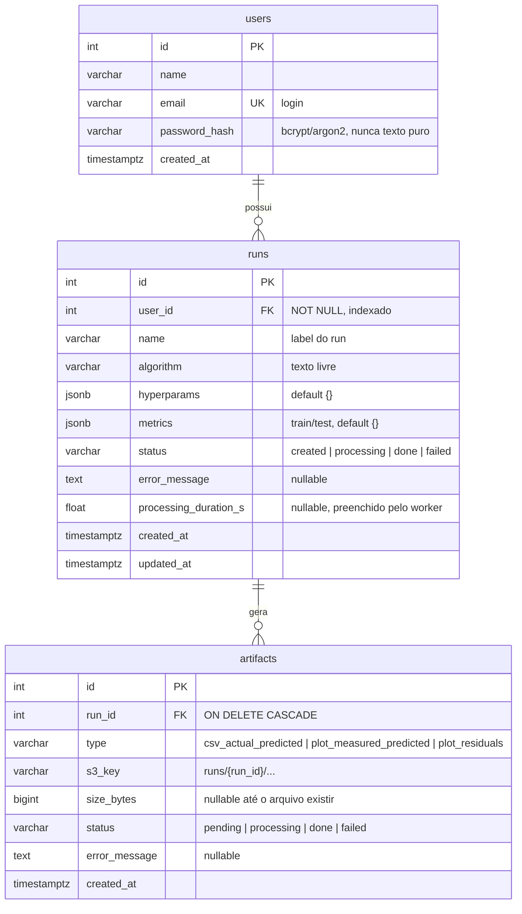

# Modelo de dados (RDS / PostgreSQL)

Modelo **fechado, migrado e testado**. Os models estão em `app/db/models/` e o schema é criado
pelo Alembic (`app/db/migrations/`). Decisões: usuários com login por e-mail e senha, runs
privados por usuário, e status e erro tanto no run quanto por artifact.



## Restrições e índices

- `users.email`: `UNIQUE NOT NULL`.
- `runs.status`, `artifacts.status`, `artifacts.type`: `CHECK` nos valores permitidos.
- `artifacts`: `UNIQUE (run_id, type)` (um run tem no máximo um artifact de cada tipo).
- `runs`: índice em `(user_id, created_at)` (listagem "meus runs, mais novos primeiro"). O Postgres
  percorre o índice de trás para frente, então ele atende `ORDER BY created_at DESC`.
- `runs.updated_at`: atualizado a cada edição (`onupdate` no SQLAlchemy). Um UPDATE feito direto
  por SQL **não** o altera.
- Defaults no banco (`server_default`): datas (`now()`), `hyperparams`/`metrics` (`{}`),
  `runs.status` (`created`) e `artifacts.status` (`pending`).

## Exclusão em cascata

| Relação | Ao apagar o pai | Motivo |
|---|---|---|
| `Run → Artifact` | apaga os artifacts (`ON DELETE CASCADE`) | os arquivos não existem sem o run |
| `User → Run` | **recusado** enquanto houver runs | evita deixar arquivos órfãos no S3 |

No SQLAlchemy, `Run.artifacts` usa `cascade="all, delete-orphan"` com `passive_deletes=True`: o
banco faz a exclusão e o SQLAlchemy não carrega os artifacts antes (o que falharia em async).
Apagar o registro **não** apaga os objetos do S3; isso é responsabilidade da rota.

## Convenção de nomes das constraints

O `Base` (`app/db/models/base.py`) define uma `naming_convention`, então os nomes são previsíveis:
`pk_<tabela>`, `uq_<tabela>_<coluna>`, `fk_<tabela>_<coluna>_<tabela_referenciada>`,
`ck_<tabela>_<nome>` e `ix_<coluna>`. Toda `CheckConstraint` **precisa** de `name=`. Isso permite
ao Alembic alterar ou remover constraints em qualquer ambiente.

## Como alterar o schema (Alembic)

O schema não é mais criado por `create_all`: a fonte da verdade do que está aplicado são os
arquivos em `app/db/migrations/versions/`, e os models dizem o que se **quer**. Fluxo:

```bash
# 1. edite o model em app/db/models/
uv run alembic revision --autogenerate -m "descrição curta"
# 2. ABRA o arquivo gerado e revise (o autogenerate erra às vezes)
uv run alembic upgrade head        # aplica (ALTER TABLE, sem perder dados)
uv run alembic check               # deve dizer "No new upgrade operations detected"
```

Outros comandos: `alembic current`, `alembic history`, `alembic downgrade -1`.

Cuidados:

- **O autogenerate não detecta mudanças em `CHECK` constraints.** Se a lista de `type`/`status`
  mudar, escreva a migration à mão (`op.drop_constraint` e `op.create_check_constraint`).
- Editar o model e esquecer de gerar a migration **não** muda o banco, e nada reclama; por isso
  o `alembic check`.
- Não misture com `create_all` num banco gerenciado pelo Alembic. Em desenvolvimento, para
  recomeçar do zero: `docker compose down -v && docker compose up -d && uv run alembic upgrade head`.
- Rode sempre da raiz do projeto (o `alembic.ini` e o `.env` são lidos dali).
- O `alembic_version` (tabela do próprio Alembic) fica no mesmo schema `public`.

## Validação

`notebooks/db_smoke_test.py` roda, célula por célula e contra um banco real, o ciclo completo:
insert, leitura do JSONB, update, recusa de `status` inválido (CHECK), recusa de `type` duplicado
(UNIQUE), recusa de apagar usuário com runs, e o cascade `Run → Artifact`.
