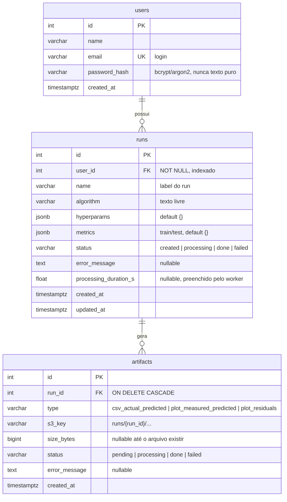

# Modelo de dados (RDS / PostgreSQL)

Rascunho para revisão. Decisões tomadas até aqui: usuários com login e-mail + senha (JWT), runs privados por usuário, status e erro tanto no run quanto por artifact.

## Restrições e índices

- `users.email`: `UNIQUE NOT NULL`.
- `runs.status`, `artifacts.status`, `artifacts.type`: `CHECK` nos valores permitidos.
- `artifacts`: `UNIQUE (run_id, type)`.
- `runs`: índice em `(user_id, created_at)` (listagem "meus runs, mais novos primeiro").
- `runs.updated_at`: atualizado a cada edição (`onupdate` no SQLAlchemy).
